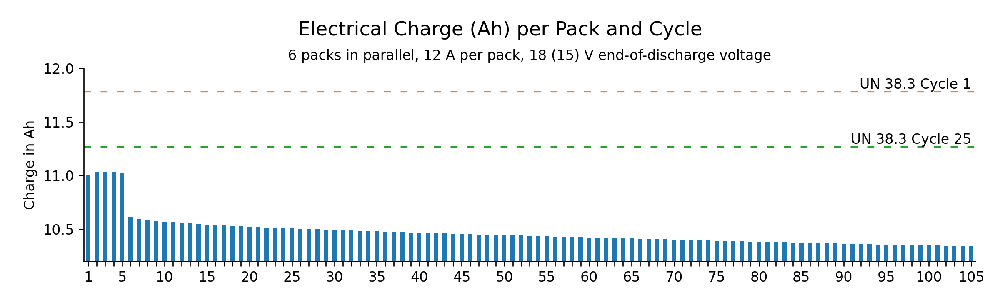
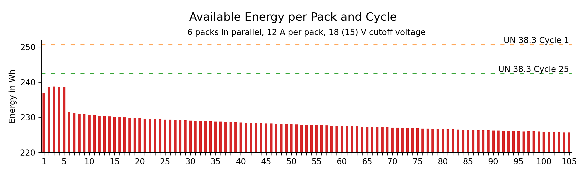

# C3 Battery Aging

This project contains data and a summary of the setup to age one battery set (6 packs) for C3 flight testing.

## Purpose

prEN 4709-001 specifies that a drone shall emit a low battery warning, so that the operator has enough time to land safely. This should also be true for aged batteries:

> **6.14.2.1**  
> The batteries used for this testing shall be in an “aged” condition as defined by the manufacturer in the technical documentation for this test to demonstrate a safe functioning of the low battery warning during a typical drone life time.

To be able to test this, a set of batteries had to be aged in a controlled manner.
starcopter defines a battery pack as aged if it has been cycled at least 100 times.

## Setup

A set of 6 battery packs were connected in parallel to a [Delta Elektronika SM17-CP-450][sm15k] power supply.
The battery packs were spaced out, to help keeping the battery packs cool through free convection.

The following battery packs were used for testing:

| Battery Pack  | Cell Pack | BMS       |
| ------------- | --------- | --------- |
| [5180 6219][] | 7399 0000 | 2885 2054 |
| [8026 3253][] | 9585 2139 | 3890 4472 |
| [2828 3578][] | 9987 8272 | 7688 4425 |
| [3750 0914][] | 6064 2192 | 2149 8986 |
| [2707 8282][] | 8499 8379 | 9599 4308 |
| [3113 2157][] | 9260 8370 | 3216 9739 |

Data was logged from both the power supply and the battery packs themselves.
The power supply was initially programmed to discharge the packs down to 15 V, like with the [UN38.3](../UN38.3/)
tests. After the first five cycles, however, it was discovered that some cells were discharged far below their
end-of-discharge voltage of 2.5 V per cell.

To avoid damaging the cells, the end-of-discharge voltage was increased to 3.0 V per cell, or 18 V in total.
The aging profile up to and after cycle 5 is shown below.

The sequence used to perform cycles 6 to 105 is available for reference [here](./bc6s6p.s).

[sm15k]: https://www.delta-elektronika.nl/products/sm15k-series
[2707 8282]: https://www.notion.so/starcopter/2707-8282-da7e6a3a6bad42439c49a23b2453dab0?pvs=4
[3113 2157]: https://www.notion.so/starcopter/3113-2157-0b244bc53801487e869f4f124a4a7624?pvs=4
[8026 3253]: https://www.notion.so/starcopter/8026-3253-6d6b2ec0507e4152988fe1cc45dd1636?pvs=4
[5180 6219]: https://www.notion.so/starcopter/5180-6219-3ebd4f287a2e4bfcb6a198941659fef6?pvs=4
[3750 0914]: https://www.notion.so/starcopter/3750-0914-b8ac6ee9832948edba5c180e3612eca3?pvs=4
[2828 3578]: https://www.notion.so/starcopter/2828-3578-b0b2bae07d5449cdab52ea6079546539?pvs=4

## Data Analysis

Raw data from both power supply and battery packs is available in the `data/` folder.

Take a look at the different source files for individual analysis steps:

- [download.sh](./download.sh): Export raw measurement data from InfluxDB.
  This step is not easily reproducible, as it requires the work-in-progress [parflux](https://gitlab.com/starcopter/lib/parflux) tool.
  The output of this script is persisted in the [data/sm15k](./data/sm15k) and [data/pyric](./data/pyric) folders.
- [01_convert.sql](./01_convert.sql): DuckDB SQL to parse raw InfluxDB data into the [data/sm15k.parquet](./data/sm15k.parquet) and [data/packs.parquet](./data/packs.parquet) files.
- [02_parse_cycles.py](./02_parse_cycles.py): Python script to find and label charge and discharge phases in SM15K logging data.
  Generates the [data/cycles.csv](./data/cycles.csv) summary file.
- [03_Plot.ipynb](./03_Plot.ipynb): Jupyter notebook to plot aging profile and other charts.

## Results

As expected, the available electrical charge and energy decrease with increasing cycles.

  
  
  

## Hacking

The data files for this project are stored via [DVC](https://dvc.org/) and can be retrieved by running `dvc pull`.

S3 credentials for the scaleway `dlake` bucket are required. Contact @Finwood if you require access.
