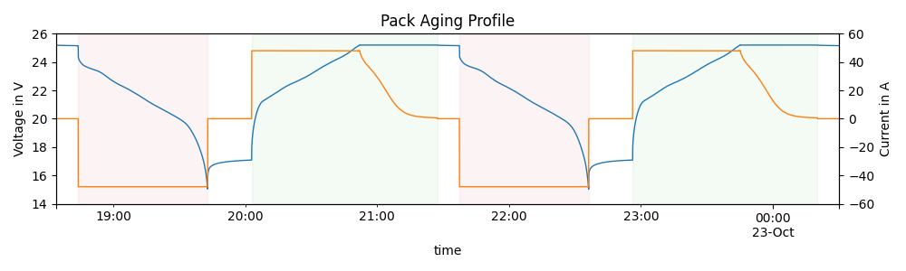
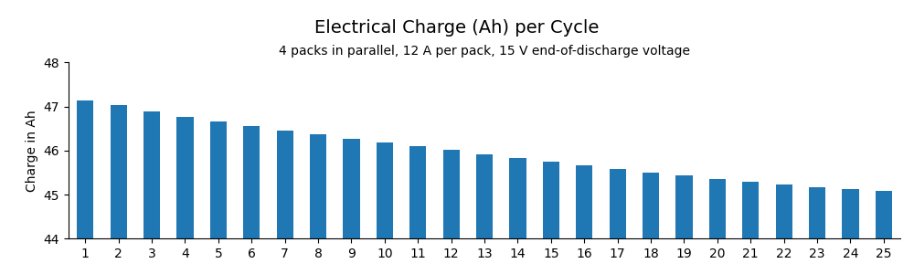

# UN38.3 Battery Aging

This project contains data and a summary of the setup to age 4 battery packs for UN38.3 testing.

## Purpose

The UN has published a [Manual of Tests and Criteria][un] for transport of dangerous goods.
This includes Li-Ion battery packs, for which test criteria are specified in chapter 38.3.
Four batteries need to be tested after 25 cycles, ending in fully charged cycles.

This project contains the description of a setup used to age four battery packs for testing,
along with raw measurement data, the data analysis notebook and a summary of the results.

[un]: https://unece.org/transport/standards/transport/dangerous-goods/un-manual-tests-and-criteria-rev8-2023

## Setup

The following battery packs were used for testing:

| Battery Pack | Cell Pack | BMS |
| ------------ | --------- | --- |
| [1757 8979][pack-1] | 1591 1836 | 7685 7468 |
| [8615 1351][pack-2] | 7266 4758 | 2155 6057 |
| [7267 4120][pack-3] | 7948 4127 | 8734 2253 |
| [1506 4809][pack-4] | 5874 5252 | 8464 7534 |

Each pack has the following electrical properties:

| Property | Value |
| ------- | ----- |
| Cell Type | [Molicel P42A][p42a] |
| Cell Configuration | 6S3P |
| Nominal Capacity | 12.6 Ah |
| Nominal Voltage | 21.6 V |
| End-of-Charge Voltage | 25.2 V |
| End-of-Discharge Voltage | 15.0 V |

All four packs were connected in parallel to a [Delta Elektronika SM17-CP-450][sm15k] power supply.
It was programmed with the sequence [BC6S](./bc6s.s) to repeatedly dischage and charge the packs
at a constant current of 12 A per pack. The sequence ends after 25 cycles.

The power supply's current and voltage were sampled at 10 Hz and logged to a database.

[pack-1]: https://www.notion.so/starcopter/Aging-test-1-8-battery-packs-5-12685df4d93280598d6ec2279e516efc?pvs=4
[pack-2]: https://www.notion.so/starcopter/Aging-test-2-8-battery-packs-6-12685df4d932808abd0bdc71812be9b2?pvs=4
[pack-3]: https://www.notion.so/starcopter/Aging-test-3-8-battery-packs-7-12685df4d93280c58d52e21cd9657493?pvs=4
[pack-4]: https://www.notion.so/starcopter/Aging-test-4-8-battery-packs-8-12685df4d932805091d3d0903310ed68?pvs=4
[p42a]: https://www.molicel.com/wp-content/uploads/INR21700P42A-V4-80092.pdf
[sm15k]: https://www.delta-elektronika.nl/products/sm15k-series

## Data Analysis

_All raw data from the aging test is available for review in the [source.parquet](./source.parquet) file._

From the current measurements, the start and end timestamps of each charge and discharge cycle were extracted.
Over each cycle, the electrical charge (Ampere-hours) and energy (Watt-hours) were calculated by numerical integration.

All code for analysis in the accompanying [Analysis.ipynb](./Analysis.ipynb) notebook.

## Results

For each cycle, the following properties were calculated and are available in the [cycles.csv](./cycles.csv) file:

- `dsg_duration`: Duration of the discharge phase.
- `dsg_charge_Ah`: Electrical charge taken from the battery during discharge.
- `dsg_energy_Wh`: Electrical energy taken from the battery during discharge.
- `chg_duration`: Duration of the charge phase.
- `chg_charge_Ah`: Electrical charge added to the battery during charge.
- `chg_energy_Wh`: Electrical energy added to the battery during charge.
- `energy_loss_Wh`: Energy difference between discharge and charge phase.

As expected, the available electrical charge decreases with increasing cycles.
This is the aging effect this test was intended to cause.

