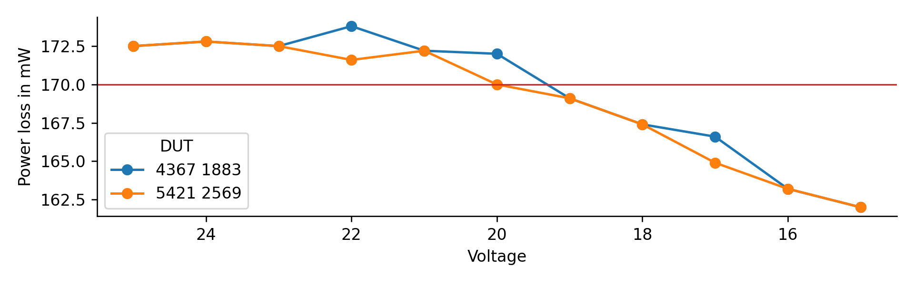

# Self-Discharge

As of firmware release [v0.3.0][], the battery packs have a rather high idle current.

Measurements (see [idle_current.csv][]) show that the idle current is between 7 and 11 mA.
The average power loss seems to be relatively stable at around 170 mW, across a wide range of voltages.

The self-discharge process can be simulated, using the discharge curve from the [UN 38.3][] cycling run.

The requirement of not loosing more than 10% of voltage over a week is met over approximately 8 weeks,
which is enough to pass all UN 38.3 tests.

[v0.3.0]: https://github.com/starcopter/bms-firmware/releases/tag/v0.3.0
[idle_current.csv]: data/idle_current.csv
[UN 38.3]: ../UN38.3/
